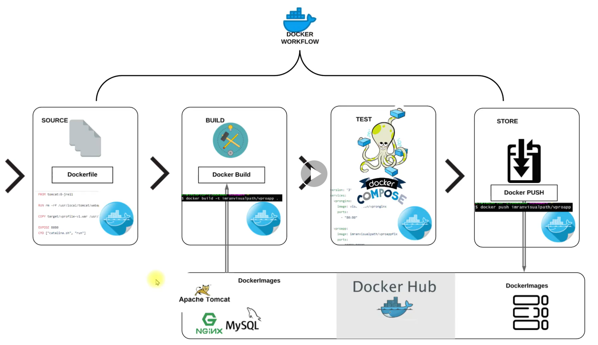
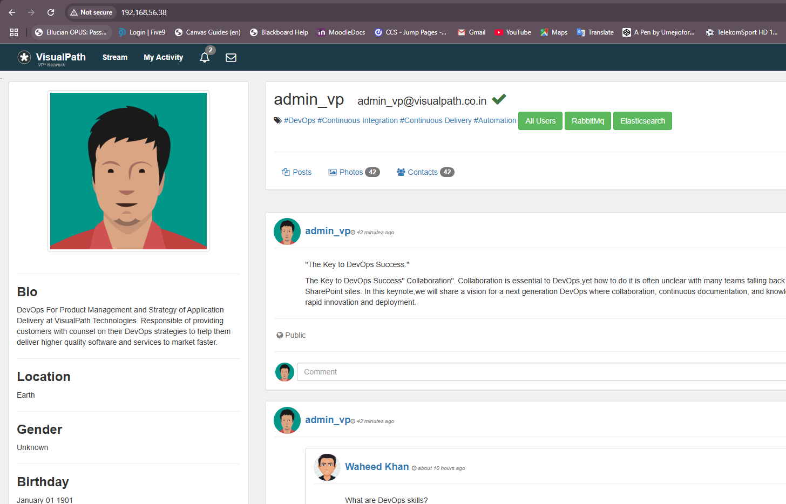
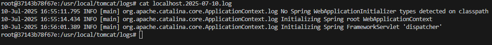
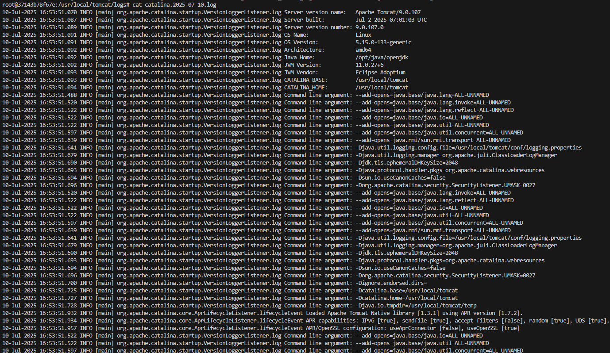

## This is a Docker project for containerization of a Java project with a multi-tier backend service

    - This project containerizes the entire backend services and frontend application writtenn in java
    - Services include MySQL, Memcache, RabbitMQ, Tomcat and Nginx services 
    - Application frontend is written in java
    - A docker-compose file to bring up all containers for backend services 
    - Note application source code is strictly in the src/ folder. 

## Pre-requisites 

    - Ensure you have docker engine installed on your local PC 
    - You can also install docker desktop if you want 
    - Create a dockerhub account for hosting your built images 
    - You can use a VM or EC instance provisioned in cloud for running the containers. Make sure to install docker engine for Ubutu
    - https://docs.docker.com/engine/install/ubuntu/

## Project Architecture 




## Set up Docker files for the backend services and run below command to build images 

    - We using a docker-compose.yml file at the root of repository to bring up all containers for the project. 

    ```bash
    docker-compose build --no-cache 
    docker compose up  -d 
    ```
- Applications should now be accessible on your VMs IP address. You should be able to log in correctly to access the application 



## Now you can push your images to your dockerhub account successfully 

    ```bash
    docker push imageName:tag
    ```

## Troubleshooting steps for any issue use below commands 

- Check container logs for any errors or warning message eg connection refused 

    ```bash
    docker logs containerID
    docker logs vproapp
    ```
- Check logs from application hosted in application container, exec into the container and access logs in tomcat directory 

    ```bash
    docker exec -it nameOfContainer bash
    docker exec -it vproapp bash                | To access the application container
    docker exec -it vprodb -u root -p           | To access the Mysql database to confirm table and users were created 
    SHOW DATABASES;                             | Used to view the dbs in the MySQL database 
    cd logs
    cat catalina.2025-07-10.log                 | To inspect the Tomcat service for any errors 
    cat localhost.2025-07-10.log                | To inspect the localhost comm with backend for any errors 
    ```
## Sample output logs from localhost.date



## Sample output logs from catalina.date



## Destroy the containers using below command 

    ```bash
    docker compose down -v 
    ```

!!! Enjoyyyyy Thanks!!!